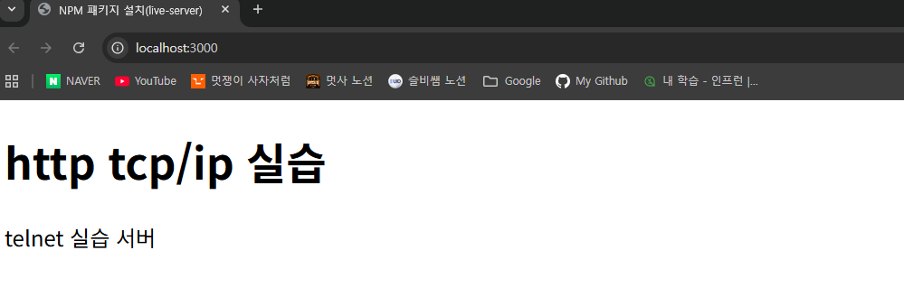
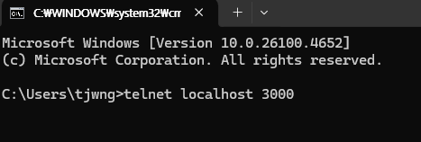
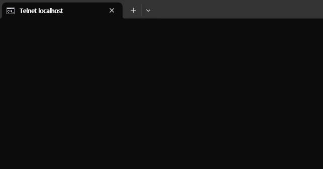

# TCP 커넥션 - 텔넷 실습

HTTP통신의 흐름을 이해하기 위해 _텔넷_ 실습을 해보았다.

1. study_http 폴더를 만든다.

2. npm 패키치 설치 후 package.json 과 package-lock.json을 설정한다.

3. live-server를 구동시킨다. 포트 번호는 3000으로 설정한다.

<br>



<br>

4. 명령 프롬프트를 열어 `telnet localhost 3000` 명령어를 입력한다

<br>



<br>

5. TCP 커넥션이 연결되면 HTTP 요청을 타이핑 해본다.

결과는 다음과 같다.



<br>

다만, 요청을 입력하려고 타이핑을 치면 바로 연결이 끊겼다는 메세지가 나온다.

<br>


<!-- 연결 끊김 이미지 삽입 -->

<br>

- 이는 Live Server의 동작 방식 때문이다. VScode의 Live Server는 "정적인 파일"을 요청하면 그 파일을 한 번만 딱 보내주고 연결을 끊도록 설계되어 있다.

```
1. 클라이언트(텔넷): GET / HTTP/1.1 이라는 요청을 보낸다.

2. 서버(Live Server): 이 요청을 받는다.

3. 서버(Live Server): 요청에 맞는 HTML 파일(예: index.html)의 내용과 함께 HTTP 응답 헤더를 보낸다.

4. 서버(Live Server): 파일 전송이 끝나면 즉시 연결을 끊는다.
```

웹 브라우저가 웹사이트에 접속할 때도 이와 동일한 과정이 일어난다. 브라우저가 서버에 파일을 요청하면 서버는 파일을 보내준 뒤 연결을 끊고 브라우저는 그 파일을 받아서 화면에 띄운다.

<br>

- 일반적인 HTTP 통신은 **Stateless(무상태성)** 라는 특징을 가지고 있다. 이는 한 번의 요청과 한 번의 응답만 처리하고 바로 연결을 끊는 방식이다. Live Server는 이 통신 방식을 그대로 따르기 때문에 누군가 명령어를 입력해서 요청을 보내는 순간 서버는 응답을 보내고 바로 연결을 끊는다.

- 따라서 텔넷 연결이 끊기는 것은 Live Server가 HTTP 프로토콜을 정상적으로 처리했다는 뜻이다.
